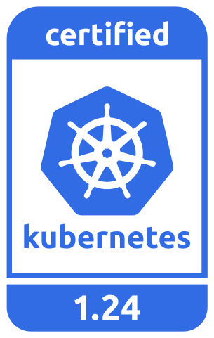

## EKS Distro Repository

| Release | Development Build Status |
|------| --- |
| 1-22 |  |
| 1-23 |  |
| 1-24 |  |
| 1-25 |  |

Amazon **EKS Distro** (EKS-D) is a Kubernetes distribution based on and used by
Amazon Elastic Kubernetes Service (EKS) to create reliable and secure Kubernetes
clusters. With EKS-D, you can rely on the same versions of Kubernetes and its
dependencies deployed by Amazon EKS. This includes the latest upstream updates,
as well as extended security patching support. EKS-D follows the same Kubernetes
version release cycle as Amazon EKS, and we provide the bits here. EKS-D offers
the same software that has enabled tens of thousands of Kubernetes clusters on
Amazon EKS.

This GitHub repository has everything required to build the components that make
up the EKS Distro from source.

## Releases

Full documentation for releases can be found on [https://distro.eks.amazonaws.com](https://distro.eks.amazonaws.com).

To receive notifications about new EKS-D releases, subscribe to the EKS-D updates SNS topic:
`arn:aws:sns:us-east-1:379412251201:eks-distro-updates`

<!--
Source: https://github.com/cncf/artwork/tree/master/projects/kubernetes/certified-kubernetes
-->

### Kubernetes 1-25

| Release | Manifest | Kubernetes Version |
| -- | --- | --- |
| 8 | [v1-25-eks-8](https://distro.eks.amazonaws.com/kubernetes-1-25/kubernetes-1-25-eks-8.yaml) | [v1.25.6](https://github.com/kubernetes/kubernetes/release/tag/v1.25.6) |

### Kubernetes 1-24

| Release | Manifest | Kubernetes Version |
| --- | --- | --- |
| 12 | [v1-24-eks-12](https://distro.eks.amazonaws.com/kubernetes-1-24/kubernetes-1-24-eks-12.yaml) | [v1.24.10](https://github.com/kubernetes/kubernetes/release/tag/v1.24.10) |

### Kubernetes 1-23

| Release | Manifest | Kubernetes Version |
| --- | --- | --- |
| 18 | [v1-23-eks-18](https://distro.eks.amazonaws.com/kubernetes-1-23/kubernetes-1-23-eks-18.yaml) | [v1.23.16](https://github.com/kubernetes/kubernetes/release/tag/v1.23.16) |

### Kubernetes 1-22

| Release | Manifest | Kubernetes Version |
| --- | --- | --- |
| 23 | [v1-22-eks-23](https://distro.eks.amazonaws.com/kubernetes-1-22/kubernetes-1-22-eks-23.yaml) | [v1.22.17](https://github.com/kubernetes/kubernetes/release/tag/v1.22.17) |

### Kubernetes 1.18, 1.19, 1.20, and 1.21: DEPRECATED

In alignment with the [Amazon EKS release calendar](https://docs.aws.amazon.com/eks/latest/userguide/kubernetes-versions.html#kubernetes-release-calendar),
EKS Distro has discontinued support of Kubernetes v1.18 - v1.21. While there are
no plans to remove these versions' images from EKS Distro ECR, there will be no
more updates, including security fixes, for them.

**Due to the increased security risk this poses, it is HIGHLY recommended that
users of v1.18 - v1.21 update to a supported version (v1.22+) as soon as
possible.**

## Development

The EKS Distro is built using
[Prow](https://github.com/kubernetes/test-infra/tree/master/prow), the
Kubernetes CI/CD system. EKS operates an installation of Prow, which is visible
at https://prow.eks.amazonaws.com/. Please read our
[CONTRIBUTING](CONTRIBUTING.md) guide before making a Pull Request.

For building EKS Distro locally, refer to the
[building-locally](docs/development/building-locally.md) guide.

For updating project dependencies, refer to the
[update-project-dependency](docs/development/update-project-dependency.md) guide.

## Security

If you discover a potential security issue in this project, or think you may
have discovered a security issue, we ask that you notify AWS Security via our
[vulnerability reporting page](http://aws.amazon.com/security/vulnerability-reporting/).
Please do **not** create a public GitHub issue.

## License

This project is licensed under the [Apache-2.0 License](LICENSE).
