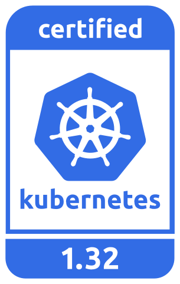
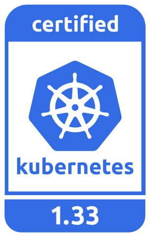
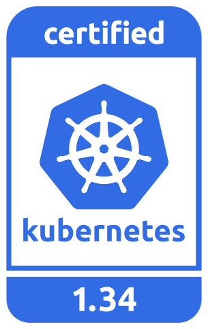

## EKS Distro Repository
---

| Release | Development Build Status                                                                                                                  |
|---------|-------------------------------------------------------------------------------------------------------------------------------------------|
| 1-29    |  |
| 1-30    |  |
| 1-31    |  |
| 1-32    |  |
| 1-33    |  |
| 1-34    |  |
| 1-35    |  |

Amazon **EKS Distro** (EKS-D) is a Kubernetes distribution based on and used by
Amazon Elastic Kubernetes Service (EKS) to create reliable and secure Kubernetes
clusters. With EKS-D, you can rely on the same versions of Kubernetes and its
dependencies deployed by Amazon EKS. This includes the latest upstream updates,
as well as extended security patching support. EKS-D follows the same Kubernetes
version release cycle as Amazon EKS, and we provide the bits here. EKS-D offers
the same software that has enabled tens of thousands of Kubernetes clusters on
Amazon EKS.

This GitHub repository has everything required to build the components that make
up the EKS Distro from source.

## DEPRECATION NOTICE
As part of an effort to streamline the maintenance of EKS-D, we will be deprecating 
the metrics-server and CSI sidecar projects from EKS-D. Releases for new versions will 
no longer be created after the dates listed below. EKS-D no longer uses these projects, 
and it does not make sense to continue building them. The remaining projects in EKS-D 
will continue to be built for the time being. Additionally, The infrastructure for 
building EKS-D from source code will no longer be maintained, including project 
directories and build scripts. However, we will continue to publish all EKS-D images 
and artifacts to their current repositories and destinations. Users can still access 
and use all released EKS-D components as before.

metrics-server project deprecation: as of 1/16/2025

csi sidecar projects deprecation: as of 3/31/2025

Find the csi sidecar images at their new location here - https://gallery.ecr.aws/csi-components

Please open an issue if you have any concerns.

## Releases

Full documentation for releases can be found on [https://distro.eks.amazonaws.com](https://distro.eks.amazonaws.com).

To receive notifications about new EKS-D releases, subscribe to the EKS-D updates SNS topic:
`arn:aws:sns:us-east-1:379412251201:eks-distro-updates`

<!--
Source: https://github.com/cncf/artwork/tree/master/projects/kubernetes/certified-kubernetes
-->
### Kubernetes 1-35

| Release | Manifest | Kubernetes Version                                                      |
| -- | --- |-------------------------------------------------------------------------|
| 4 | [v1-35-eks-4](https://distro.eks.amazonaws.com/kubernetes-1-35/kubernetes-1-35-eks-4.yaml) | [v1.35.4](https://github.com/kubernetes/kubernetes/release/tag/v1.35.4) |

### Kubernetes 1-34

| Release | Manifest | Kubernetes Version                                                      |
| -- | --- |-------------------------------------------------------------------------|
| 14 | [v1-34-eks-14](https://distro.eks.amazonaws.com/kubernetes-1-34/kubernetes-1-34-eks-14.yaml) | [v1.34.3](https://github.com/kubernetes/kubernetes/release/tag/v1.34.3) |
### Kubernetes 1-33

| Release | Manifest | Kubernetes Version                                                      |
| -- | --- |-------------------------------------------------------------------------|
| 23 | [v1-33-eks-23](https://distro.eks.amazonaws.com/kubernetes-1-33/kubernetes-1-33-eks-23.yaml) | [v1.33.7](https://github.com/kubernetes/kubernetes/release/tag/v1.33.7) |

### Kubernetes 1-32

| Release | Manifest | Kubernetes Version                                                      |
| -- | --- |-------------------------------------------------------------------------|
| 32 | [v1-32-eks-32](https://distro.eks.amazonaws.com/kubernetes-1-32/kubernetes-1-32-eks-32.yaml) | [v1.32.11](https://github.com/kubernetes/kubernetes/release/tag/v1.32.11) |

### Kubernetes 1-31

| Release | Manifest | Kubernetes Version                                                        |
| -- | --- |---------------------------------------------------------------------------|
| 39 | [v1-31-eks-39](https://distro.eks.amazonaws.com/kubernetes-1-31/kubernetes-1-31-eks-39.yaml) | [v1.31.14](https://github.com/kubernetes/kubernetes/release/tag/v1.31.14) |

### Kubernetes 1-30

| Release | Manifest | Kubernetes Version |
| -- | --- | --- |
| 51 | [v1-30-eks-51](https://distro.eks.amazonaws.com/kubernetes-1-30/kubernetes-1-30-eks-51.yaml) | [v1.30.14](https://github.com/kubernetes/kubernetes/release/tag/v1.30.14) |

### Kubernetes 1-29

| Release | Manifest | Kubernetes Version |
| -- | --- | --- |
| 58 | [v1-29-eks-58](https://distro.eks.amazonaws.com/kubernetes-1-29/kubernetes-1-29-eks-58.yaml) | [v1.29.15](https://github.com/kubernetes/kubernetes/release/tag/v1.29.15) |

### Kubernetes 1.18 - 1.28: DEPRECATED

In alignment with the [Amazon EKS release calendar](https://docs.aws.amazon.com/eks/latest/userguide/kubernetes-versions.html#kubernetes-release-calendar),
EKS Distro has discontinued support of Kubernetes v1.18 - v1.28. While there are
no plans to remove these versions' images from EKS Distro ECR, there will be no
more updates, including security fixes, for them.

**Due to the increased security risk this poses, it is HIGHLY recommended that
users of v1.18 - v1.28 update to a supported version (v1.29+) as soon as
possible.**

## Development

The EKS Distro is built using
[Prow](https://github.com/kubernetes/test-infra/tree/master/prow), the
Kubernetes CI/CD system. EKS operates an installation of Prow, which is visible
at https://prow.eks.amazonaws.com/. Please read our
[CONTRIBUTING](CONTRIBUTING.md) guide before making a Pull Request.

For building EKS Distro locally, refer to the
[building-locally](docs/development/building-locally.md) guide.

For updating project dependencies, refer to the
[update-project-dependency](docs/development/update-project-dependency.md) guide.

## Security

If you discover a potential security issue in this project, or think you may
have discovered a security issue, we ask that you notify AWS Security via our
[vulnerability reporting page](http://aws.amazon.com/security/vulnerability-reporting/).
Please do **not** create a public GitHub issue.

## License

This project is licensed under the [Apache-2.0 License](LICENSE).
